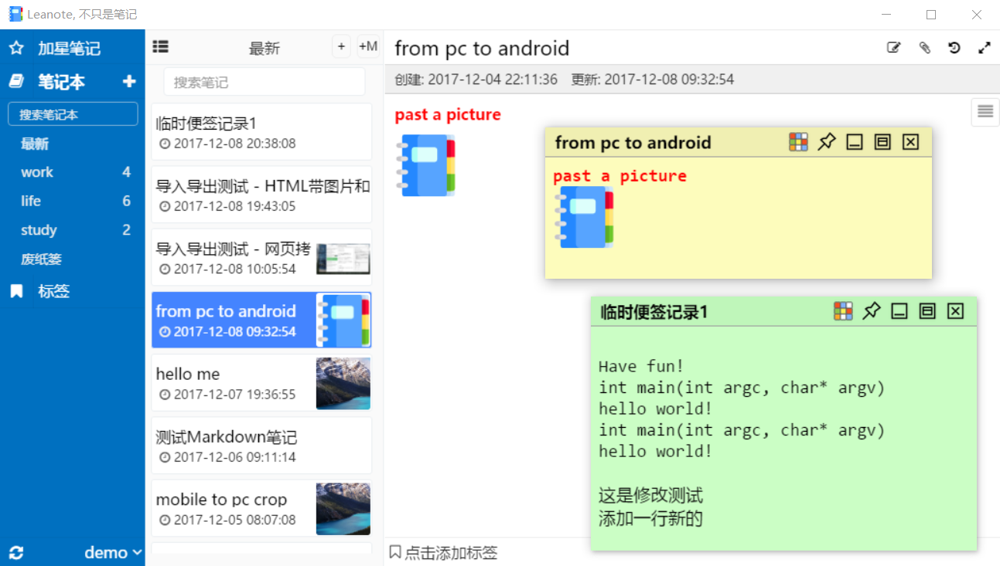

# Leanote Desktop App

[](https://gitter.im/leanote/desktop-app?utm_source=badge&utm_medium=badge&utm_campaign=pr-badge)

**This the Leanote desktop app modified by xpgo.** Thanks the [Leanote Team](http://app.leanote.com) for sharing such wouderful app.

The preview of the modified version of Leanote:


## Extended features based on the original version
- Added blue_pure theme (see the preview)
- Added githubx markdown theme (see the preview)
- Increased the whole font size
- Import wiz notes (为知笔记) correctlly, even with attachments
- Open attachment link directly in the note
- Fixed image display problems (for those who deploy leanote server themselves)
- Upload image and attachment without size limits
- Double click or use `F4` to enter edit mode
- Sticky note. You can open an HTML note in a separated window (sticky note like), so you can use it to collect temporary text. The content in the sticky note will be saved when it is closed (or use `ctrl+s` to save it). Moreover, you can customize shortkeys in the sticky note to do more, i.e. insert data, time, horizontal rule and so on. 

## Download
Download the code and use electron to run this app.
**All the new features exteded by xpgo are currently available only in the dev braunch.**

## How to develop it

### 1. Install Electron

See https://github.com/atom/electron#downloads


### 2. Run it with electron

Download this project, and run

````shell
# 1. use gulp to parse less
$> cd PATH-TO-LEANOTE-DESKTOP-APP/dev
$> npm install
$> gulp dev

# 2. run with electron
$> cd PATH-TO-LEANOTE-DESKTOP-APP
$> electron .
```

## Docs

Please see https://github.com/leanote/desktop-app/wiki


## LICENSE

[LICENSE](https://github.com/leanote/desktop-app/blob/master/LICENSE)

```
LEANOTE - NOT JUST A NOTEPAD!

Copyright by the contributors.

This program is free software; you can redistribute it and/or modify
it under the terms of the GNU General Public License as published by
the Free Software Foundation; either version 2 of the License, or
(at your option) any later version.

This program is distributed in the hope that it will be useful,
but WITHOUT ANY WARRANTY; without even the implied warranty of
MERCHANTABILITY or FITNESS FOR A PARTICULAR PURPOSE.  See the
GNU General Public License for more details.

Leanote destop app is licensed under the GPL v2.
```